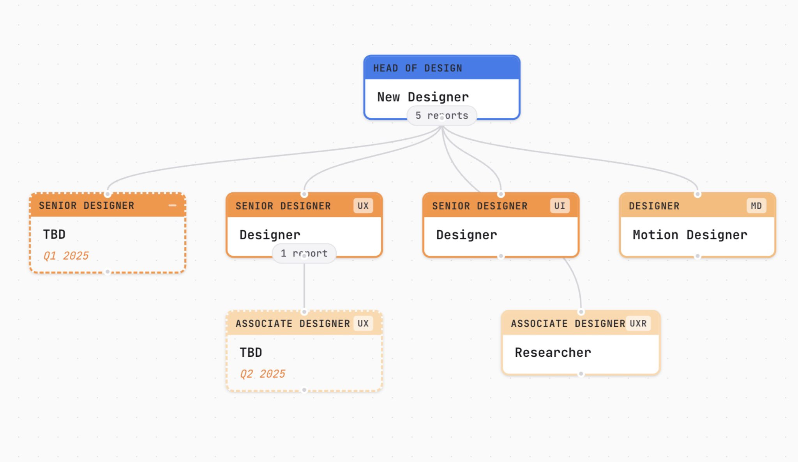

# Design Team Mapper

An interactive web application for planning hiring and growth progression in design teams. Visualize your org structure, track promotions, and plan future hires.

**Live at [MapYour.Org](https://mapyour.org)**

## Features

- **Interactive Org Chart** - Drag-and-drop flowchart visualization using React Flow
- **Team Member Management** - Add team members and planned hires with detailed profiles
- **Reporting Relationships** - Connect nodes to define manager-report structures
- **Span of Control Warnings** - Visual alerts when managers exceed configurable thresholds
- **Promotion Tracking** - Automatic eligibility indicators based on tenure and level configuration
- **Career Tracks** - Configurable IC/Manager split at any level
- **Export Options** - Save as PNG, PDF, or JSON backup
- **Auto-Arrange** - One-click hierarchical layout
- **Persistent Storage** - All data saved to localStorage

## Running Locally

### Prerequisites

- Node.js (v18 or higher recommended)
- npm

### Setup

```bash
# Clone the repository
git clone https://github.com/inosaint/design-team-map.git
cd design-team-map

# Install dependencies
npm install

# Start development server
npm run dev
```

The app will be available at `http://localhost:5173`

### Other Commands

```bash
# Build for production
npm run build

# Preview production build
npm run preview

# Run linting
npm run lint
```

## Tech Stack

- **React 19** + TypeScript
- **Vite** - Build tool
- **React Flow** (@xyflow/react) - Flowchart visualization
- **Zustand** - State management with localStorage persistence
- **CSS Modules** - Scoped styling

## Changelog

See [CHANGELOG.md](./CHANGELOG.md) for release history and updates.

## License

MIT
