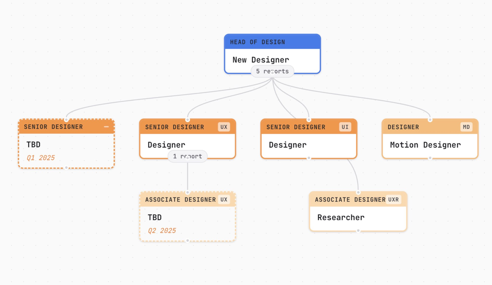

# Org Mapper

An interactive web application for planning hiring and growth progression in design teams. Visualize your org structure, track promotions, and plan future hires.

**Live at [MapYour.Org](https://mapyour.org)**

## Features

- **Interactive Org Chart** - Drag-and-drop flowchart visualization using React Flow
- **Team Member Management** - Add team members and planned hires with detailed profiles
- **Reporting Relationships** - Connect nodes to define manager-report structures
- **Fast Connected Card Creation** - Drop a loose connection on the canvas to create a connected team member
- **Span of Control Warnings** - Visual alerts when managers exceed configurable thresholds
- **Promotion Tracking** - Automatic eligibility indicators based on tenure and level configuration
- **Growth Planning** - Track Planned, Doing, and Completed growth items plus meeting notes for each team member
- **Career Tracks** - Configurable IC/Manager split at any level
- **Export Options** - Save Chart JSON, Growth Plan JSON, or Chart PNG
- **Auto-Arrange** - One-click hierarchical layout
- **Persistent Storage** - All data saved to localStorage

## Running Locally

If you want to run this locally, you an also do that in a straightforward way.

### Prerequisites

- Node.js (v18 or higher recommended)
- npm

### Setup

```bash
# Clone the repository
git clone https://github.com/inosaint/design-team-map.git
cd design-team-map

# Install dependencies
npm install

# Start development server
npm run dev
```

The app will be available at `http://localhost:5173`

### Other Commands

```bash
# Build for production
npm run build

# Preview production build
npm run preview

# Run linting
npm run lint
```

## Loading a Chart via Link (for AI agents / automation)

Anyone — a script, an AI agent, another tool — can build a chart and hand the user a link that loads it directly, no file upload needed. Open the app with a `chart` query param containing a base64url-encoded JSON payload, using the same shape as the "Import JSON" feature in Settings:

```
https://mapyour.org/?chart=<base64url(JSON.stringify(importData))>
```

Use `encodeChartForUrl` from `src/utils/importData.ts` to build this value (plain `encodeURIComponent(JSON.stringify(...))` also works but produces a much longer, uglier URL since JSON's quotes/braces each balloon into 3-character `%XX` sequences under percent-encoding).

Where `importData` is:

```json
{
  "nodes": [
    { "id": "1", "name": "Priya Shah", "designerType": "ux", "level": 6, "yearsOfExperience": 8, "managerId": null, "isPlannedHire": false },
    { "id": "2", "name": "Alex Kim", "designerType": "product", "level": 3, "yearsOfExperience": 2, "managerId": "1", "isPlannedHire": false }
  ],
  "verticals": [],
  "settings": { "designerTypes": [...], "levels": [...], ... }
}
```

- `nodes` — a flat list of `TeamMember`/`PlannedHire` records (see `src/types/index.ts`); `managerId: null` marks the top of the chart, any other `managerId` points at another node's `id`.
- `settings` — the same `designerTypes`/`levels` config shown in Settings; the easiest way to get a valid one is to export an existing chart from the app (Settings → Import/Export → "Export JSON") and use its `settings` block as a starting point.
- No pixel positions to compute: if `nodePositions` is omitted, the chart is auto-arranged into a hierarchy (same as the "Auto-Arrange" button) based on each node's `managerId`.
- The whole payload is validated on load; if it doesn't match, the chart is left untouched and an error toast is shown instead.
- This travels in a URL query string, so keep it to a reasonably small chart (tens of people) rather than an entire org.

This reuses the exact same `importData` action and validation as the file-based JSON import — see `src/utils/importData.ts`.

## Tech Stack

- **React 19** + TypeScript
- **Vite** - Build tool
- **React Flow** (@xyflow/react) - Flowchart visualization
- **Zustand** - State management with localStorage persistence
- **CSS Modules** - Scoped styling

## Changelog

See [CHANGELOG.md](./CHANGELOG.md) for release history and updates.

## License

[CC BY-NC-SA 4.0](https://creativecommons.org/licenses/by-nc-sa/4.0/) - See [LICENSE](./LICENSE) for details.
